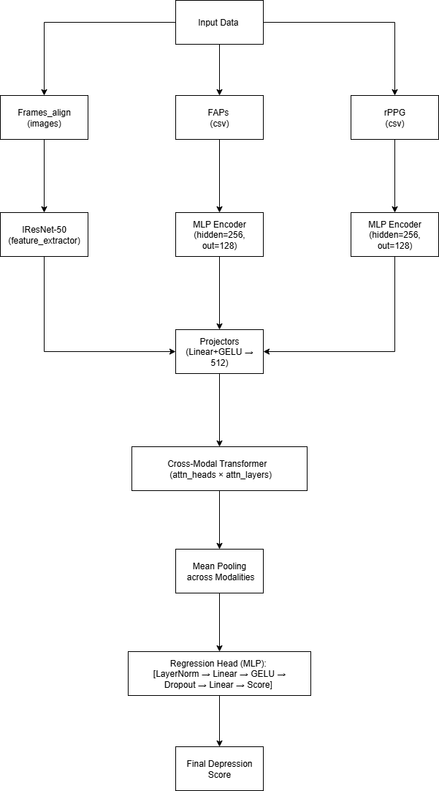

# Multimodal Depression Severity Estimation (AVEC2014)
This repository contains the official implementation of our work on **multimodal depression severity estimation** using the **AVEC2014 dataset**.
We combine visual frames, Facial Action Points (FAPs), and remote photoplethysmography (rPPG) signals with cross-modal attention and transformer-based fusion.
---
## Key Contributions
- **Multimodal fusion for depression estimation**
	- Combined **frames, FAPs, and rPPG** for robust representation.
	- Designed a **cross-modal attention transformer** for effective modality interaction.
- **Detailed Ablation Study**
	- Frames only
	- Frames + rPPG
	- Frames + FAPs
	- Frames + FAPs + rPPG (full model)
- **Comprehensive Evaluation**
	- Metrics: **MAE, RMSE, PCC, CCC**
	- Also reported **#Parameters** for model complexity.
---
## Results (Ablation Study on AVEC2014)
| Modalities              | MAE ↓ | RMSE ↓ | PCC ↑  | CCC ↑  | #Params (M) |
|------------------------|-------|--------|--------|--------|-------------|
| Frames                 | 9.70  | 9.74   | 0.258  | 0.061  | 56.27       |
| Frames + rPPG          | 9.71  | 9.75   | 0.185  | 0.050  | 56.37       |
| Frames + FAPs          | 6.55  | 7.19   | 0.657  | 0.591  | 56.37       |
| Frames + FAPs + rPPG   | **6.53** | **7.08** | **0.678** | **0.610** | 56.48       |
✅ Multimodal fusion improves performance compared to unimodal baselines.
✅ Our full model achieves the best **MAE, RMSE, PCC, and CCC**.
---
## Model Architecture (in simple block diagram)




---
## ⚙️ Training
Example (Frames + FAPs + rPPG):
```bash
python main.py \
	--data_dir /path/to/dataset/avec14 \
	--label_file /path/to/multimodal_labels_fixed.csv \
	--train_data AVEC2014-train \
	--val_data AVEC2014-dev \
	--test_data AVEC2014-test \
	--modalities frames_align faps rppg_physformer \
	--pretrain webface \
	--batch_size 2 \
	--max_epochs 150 \
	--learning_rate 1e-5 \
	--dropout_rate 0.7 \
	--fusion_dim 512 \
	--attn_heads 8 \
	--attn_layers 4
```
For ablations, change the `--modalities` flag accordingly:
- `frames_align`
- `frames_align rppg_physformer`
- `frames_align faps`
- `frames_align faps rppg_physformer`
### 📈 Metrics Logged
- MAE (Mean Absolute Error)
- RMSE (Root Mean Squared Error)
- PCC (Pearson Correlation Coefficient)
- CCC (Concordance Correlation Coefficient)
- #Params (total & trainable)
---

## Author & Contribution
- Muhammad Bilal (Implementation, Experiments, Ablation Study, Analysis)
- Dr Muhammad Turyalai Khan (Guidance, Research Direction)
---
## 📌 Notes
- Dataset: AVEC2014
- Pretrained weights: WebFace IResNet-50
- Framework: PyTorch Lightning


