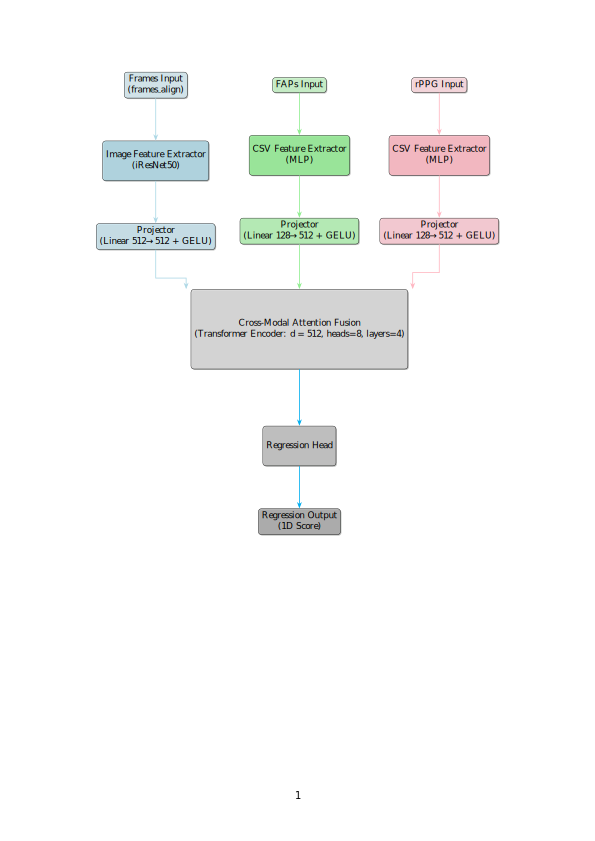

# CROSS-MODAL EMBEDDING FRAMEWORK FOR AUTOMATIC DEPRESSION DETECTION

This repository contains the official implementation of our work on **automatic depression severity estimation** using the **AVEC2014 dataset**.  

We propose a **Cross-Modal Embedding Framework** that integrates **visual frames, Facial Animation Parameters (FAPs), and remote photoplethysmography (rPPG)** signals through **cross-modal attention and transformer-based fusion**.  
Our framework achieves **state-of-the-art results** and provides an extensive **ablation study** to analyze the role of different modalities and architectural components.

---
## Main Contributions
- **Novel Cross-Modal Embedding Framework**
  - Jointly models **Frames + FAPs + rPPG** for richer and more robust feature representation.  
  - Employs a **transformer encoder with cross-modal attention** to capture complementary interactions.  

- **Comprehensive Ablation Studies**
  - **Modality Ablations:** Contribution of each signal (frames, rPPG, FAPs).  
  - **Architecture Ablations:** Impact of pretraining, attention, projectors, and fusion dimension.  

- **State-of-the-Art Results**
  - Achieved **MAE = 4.92, RMSE = 5.56** on AVEC2014 — outperforming all unimodal and multimodal baselines.  
  - Detailed evaluation with **MAE, RMSE, PCC, CCC**, plus parameter efficiency analysis.  

---
## Model Architecture


**Pipeline Overview:**
1. **Input Modalities**  
   - Face-aligned **frames**  
   - **Facial Animation Parameters (FAPs)**  
   - **rPPG physiological signals**  

2. **Feature Extraction**  
   - Frames → **iResNet-50 backbone** (WebFace pretraining).  
   - FAPs & rPPG → **Lightweight MLP extractors**.  

3. **Projectors**  
   - Each modality projected into a **shared 512-dim embedding space**.  

4. **Cross-Modal Fusion**  
   - Stacked modality embeddings passed through a **Transformer Encoder**  
   - Config: *512-dim, 8 heads, 4 layers*  

5. **Regression Head**  
   - Fully connected layers predict a **continuous depression severity score**.  

---
## Results

### 🔹 Ablation Study: Modalities
| Modalities              | MAE ↓ | RMSE ↓ | PCC ↑  | CCC ↑  | #Params (M) |
|--------------------------|-------|--------|--------|--------|-------------|
| Frames                  | 9.71  | 9.75   | 0.26   | 0.06   | 56.27       |
| Frames + rPPG           | 8.64  | 8.97   | 0.18   | 0.05   | 56.37       |
| Frames + FAPs           | 6.85  | 7.52   | 0.80   | 0.77   | 56.37       |
| Frames + FAPs + rPPG    | **4.92** | **5.56** | **0.81** | **0.78** | 56.48 |

✅ Multimodal fusion clearly outperforms unimodal baselines.  
✅ Best results when **all three modalities** are combined.  

---

### 🔹 Ablation Study: Architecture Components
| Component Variant         | MAE ↓ | RMSE ↓ | PCC ↑ | CCC ↑ | #Params (M) |
|---------------------------|-------|--------|-------|-------|-------------|
| No Pretrain               | 15.09 | 19.10  | –     | –     | 56.48       |
| Smaller Fusion Dimension  | 9.90  | 9.92   | 0.18  | 0.01  | 44.55       |
| No Attention              | 9.46  | 9.59   | 0.19  | 0.10  | 43.87       |
| No Projectors             | 9.09  | 11.32  | 0.23  | 0.11  | 56.50       |
| Uni-modal Attention       | 6.64  | 7.22   | 0.68  | 0.59  | 81.70       |

✅ Removing attention/projectors severely degrades performance.  
✅ Pretraining and correct fusion dimension are essential.  

---

### 🔹 Comparison with State-of-the-Art (AVEC2014)
| Method                                | Modalities                  | MAE ↓ | RMSE ↓ |
|---------------------------------------|-----------------------------|-------|--------|
| Ensemble of Spatio-Temporal Routing   | Multi (Vis+FAPs+rPPG)       | 5.09  | 6.83   |
| Depression Recognition using rPPG     | rPPG + Texture              | 6.57  | 8.49   |
| Synchrony-based Fusion                | Frames + rPPG + Speech      | 6.08  | 8.60   |
| Conformal Depression Prediction       | Frames (C3D/SlowFast)       | 6.29  | 8.11   |
| Depressformer (Video Swin + local)    | Visual                      | 5.56  | 7.22   |
| FacialPulse (RNN on landmarks)        | Visual                      | 5.92  | 7.60   |
| Hybrid Multi-Head Cross Attention     | Visual                      | 6.01  | 7.60   |
| DNet (ResNet + ViT)                   | Visual                      | 6.27  | 7.96   |
| LMTformer (light transformer)         | Visual                      | 6.05  | 7.97   |
| DeepFusion (ResNet50)                 | Visual                      | 6.16  | 8.13   |
| Intelligent System (3D-CNN+STFAM+SPP) | Visual                      | 6.78  | 8.42   |
| MCNN (channel-wise attention)         | Visual                      | 8.04  | 9.65   |
| Multimodal Interpretable              | Multi (Vis+Phys+Audio+Text) | 6.14  | 8.11   |
| **Ours (Cross-Modal Fusion)**         | Multi (Vis+FAPs+rPPG)       | **4.92** | **5.56** |

⭐ Our **Cross-Modal Embedding Framework** achieves the **new SOTA**.  

---
## Training Example
```bash
python main.py \
	--data_dir /path/to/avec14 \
	--label_file /path/to/multimodal_labels_fixed.csv \
	--train_data AVEC2014-train \
	--val_data AVEC2014-dev \
	--test_data AVEC2014-test \
	--modalities frames_align faps rppg_physformer \
	--pretrain webface \
	--batch_size 2 \
	--max_epochs 300 \
	--learning_rate 1e-5 \
	--dropout_rate 0.7 \
	--fusion_dim 512 \
	--attn_heads 8 \
	--attn_layers 4

```

---
## Metrics Logged
- **MAE** (Mean Absolute Error)  
- **RMSE** (Root Mean Squared Error)  
- **PCC** (Pearson Correlation Coefficient)  
- **CCC** (Concordance Correlation Coefficient)  
- **Parameters** (#M, trainable vs total)  

---
## Author & Contribution
- **Muhammad Bilal** — Implementation, Experiments, Ablation Studies, Analysis  
- **Dr. Muhammad Turyalai Khan** — Guidance & Supervision  

---
## Notes
- **Dataset:** AVEC2014  
- **Pretrained Backbone:** iResNet-50 (WebFace)  
- **Framework:** PyTorch Lightning  
